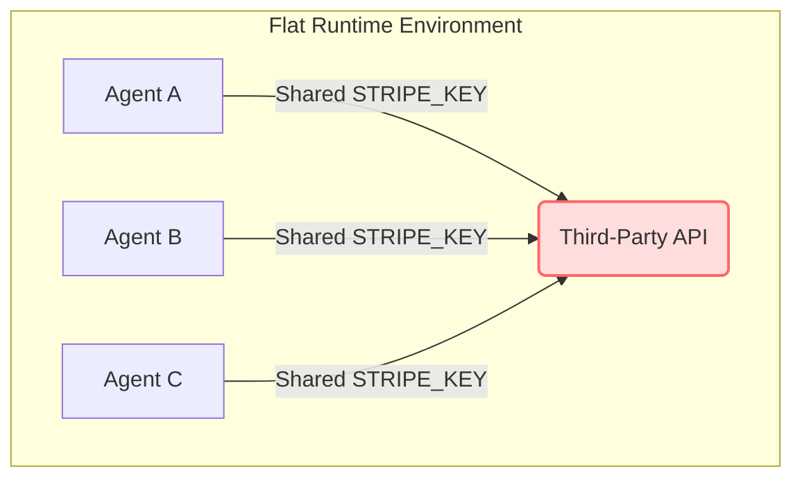
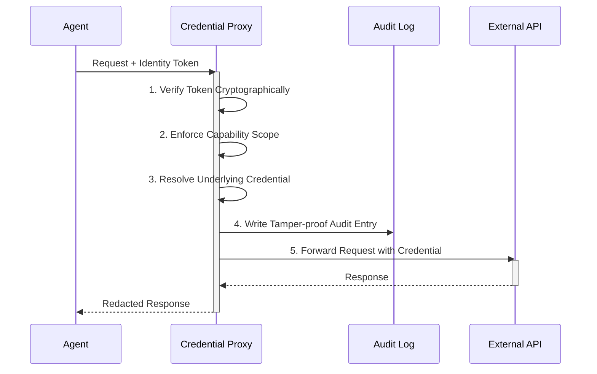

# Agent Identity

> [NOTE]
> **Core Concept:** Agent Identity shifts the security perimeter from the *environment* to the *individual agent*.

In traditional software, credentials are loaded at startup by a single trusted process. The process is the identity — if the server has the API key, it's authorized. This model worked because applications were deterministic: they executed pre-written code paths, not arbitrary instructions.

AI agents break this assumption. An agent interprets natural language, processes untrusted inputs, and dynamically decides which APIs to call. When three agents share the same Stripe key and one makes a suspicious charge, there's no way to know which agent did it. When a prompt injection tricks an agent into exfiltrating data, there's no way to isolate the compromised agent without shutting everything down.

Agent Identity solves this by making every credential access traceable to the specific agent that requested it.

---

## The Problem with Flat Credential Pools

Most secrets managers treat the runtime environment as a single identity. Every process, every agent, every tool in that environment gets the same level of access.

> [WARNING]
> This creates three structural failures:
> 1. **No attribution**: Audit logs show *that* a credential was used, but not *who* used it. When a billing spike occurs at 3am, you're left guessing.
> 2. **No isolation**: A compromised agent has access to every credential in the pool. Prompt injection against one agent is a breach of the entire system.
> 3. **No surgical revocation**: To cut off a misbehaving agent, you must rotate the credential itself, immediately breaking every other agent that depends on it.

---

## Three Levels of Identity

AgentSecrets introduces a graduated identity model. Each level adds stronger guarantees while remaining backwards-compatible with the previous one.

| Feature | Level 0: Anonymous | Level 1: Declared | Level 2: Issued |
| :--- | :--- | :--- | :--- |
| **Identification** | None | Agent self-reports name | Cryptographic token |
| **Spoofing Resistance**| N/A | Low (Trust-based) | High (Cryptographically verified) |
| **Surgical Revocation**| No | No | Yes |
| **Audit Trace** | `"anonymous"` | `"my-agent"` | `"my-agent" + footprint` |
| **Use Case** | Local Prototyping | Trusted Debugging | Production Systems |

### Level 0: Anonymous
The default state. The agent makes a request through the proxy without identifying itself. The request is logged, redacted, and allowlisted — but the audit trail shows `anonymous` as the caller.

> [TIP]
> Use Anonymous identity only during local development when you are the sole developer running a single agent.

### Level 1: Declared
The agent self-reports a name. The proxy logs this name but does not cryptographically verify it. 

Declared identity is extremely useful for debugging multi-agent pipelines in trusted environments. You can filter audit logs by agent name, trace request flows, and diagnose which agent is generating unexpected calls. However, because it lacks cryptographic verification, it is vulnerable to spoofing by compromised agents.

### Level 2: Issued (Cryptographic)
The agent presents a cryptographic token (prefixed with `agt_`) issued by a workspace administrator. The proxy validates the token against the workspace before resolving any credentials.

> [IMPORTANT]
> **Why use Issued Tokens?**
> - **Proof of origin**: Cryptographically ties the request to a specific registered agent.
> - **Instant revocation**: A single token can be revoked without affecting other agents.
> - **Capability enforcement**: Tokens can be rigidly scoped to specific secrets and projects.

---

## Identity as a Security Boundary

Agent Identity is not just an audit feature — it is the foundation for runtime access control. By moving the security boundary to the agent itself, you can establish Zero Trust architectures within your own codebases.

### Key Security Benefits

- **Capabilities**: Restrict an agent named `email-sender` to only access the `SENDGRID_KEY`, preventing it from ever touching the `STRIPE_KEY` even if compromised by prompt injection.
- **Secret Policies**: Individual secrets can mandate specific identity levels. For example, a production database credential can be configured to completely reject `Anonymous` or `Declared` requests.
- **Revocation without downtime**: When you revoke a token, only that agent loses access. Every other agent continues operating without requiring credential rotation or downtime.

---

## Next Steps

To see exactly how to implement Agent Identity in your code, manage tokens, and set capabilities, read the [Agent Identity CLI Reference](/docs/agent-identity/overview).
