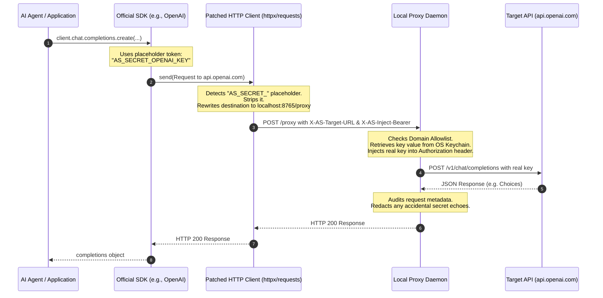

# Python SDK

The Python SDK provides a typed interface for making zero-knowledge calls from your code. It has no `get()` method — there is no way to retrieve a credential value into your calling code. The only operations available keep the value out of your process.

---

## Installation

```bash
pip install agentsecrets
```

`agentsecrets` is the Python SDK package. The CLI is `agentsecrets-cli` — a separate package. You need the CLI installed and the proxy running to use the SDK.

---

## Initializing the client

```python
from agentsecrets import AgentSecrets

# Defaults — uses active workspace, project, and environment from global config
client = AgentSecrets()

# Explicit configuration
client = AgentSecrets(
    workspace="Acme Engineering",
    project="payments-service",
)

# With declared agent identity
client = AgentSecrets(agent_id="billing-processor")

# With issued cryptographic token
client = AgentSecrets(agent_token="agt_ws01hxyz_4kR9mNpQ...")

# Custom proxy port
client = AgentSecrets(port=9000)

# Auto-start proxy if not running (default: True)
client = AgentSecrets(auto_start=True)
```

No credentials are passed into the constructor.

### Agent Token Keychain Resolution

Instead of hardcoding sensitive agent tokens in your code or environment variables, you can store your issued agent tokens directly in the native OS Keychain (via the prompt during `agentsecrets agent token issue`).

In your code, you can reference the token using the format `AGENTNAME_TOKEN` (case-insensitive). The proxy engine will automatically resolve the reference to the actual token value from your keychain at runtime:

```python
# The SDK passes "BILLING-PROCESSOR_TOKEN" to the proxy,
# which resolves the actual credential from the OS Keychain.
client = AgentSecrets(agent_token="BILLING-PROCESSOR_TOKEN")
```

This keeps your code repos and environments entirely free of raw agent tokens.

---

## Transparent HTTP client interception (Automatic proxy routing)

In addition to explicit `client.call()` invocations, the Python SDK supports automatic, zero-code interception of outgoing HTTP requests made by standard client libraries. This allows you to integrate AgentSecrets with official third-party SDKs (such as the official `openai` or `stripe` packages) without rewriting any of their internal network calling code, retaining full use of their helpers, classes, and streaming parameters.

### The Security Dilemma

Standard API client libraries are designed around a simple but insecure assumption: they require the plaintext credential value to be present in application memory at initialization time. For example:

```python
# Insecure: raw keys are loaded into process memory, exposing them to log leaks or extraction
client = openai.OpenAI(api_key=os.environ["OPENAI_API_KEY"])
```

If an AI agent is hijacked via prompt injection, or if a dependency is compromised, these in-memory credentials can be dumped. 

Normally, enforcing zero-trust security would require you to rewrite all your API logic using custom raw HTTP calls (via `client.call()`), which strips away the ease-of-use of official SDKs. Interception resolves this by allowing you to initialize official SDKs with secure **placeholder strings**, while the underlying library dynamically redirects calls to the secure proxy.

---

### How Interception Works Under the Hood

When you call `agentsecrets.init()`, the SDK dynamically patches (`monkey patches`) the sending pipelines of Python's most popular HTTP libraries:

* `requests.Session.send`
* `httpx.Client.send` (Synchronous client)
* `httpx.AsyncClient.send` (Asynchronous client)

Since almost all major Python SDKs (including `openai`, `stripe`, `anthropic`, `google-generativeai`, `pinecone`, `github`, and `sendgrid`) use `requests` or `httpx` internally, patching these three root methods intercepts the network boundary for the entire Python ecosystem.



### The Request lifecycle

:::step
1. **Initialize interception**
   Call `agentsecrets.init()` once at the entry point of your application. This registers the monkey patches.
2. **Configure placeholders**
   Pass placeholder references instead of raw keys to third-party SDK constructors. The placeholder format can be:
   - `Bearer AS_SECRET_<KEY_NAME>` (for standard authorization headers)
   - `AS_SECRET_<KEY_NAME>` (for general header values or API keys)
3. **Automatic detection**
   The patched HTTP client scans all outgoing request headers. If an `AS_SECRET_` placeholder is found, it is stripped from the request headers to ensure it never exits the local boundary.
4. **Proxy redirection**
   The client redirects the target URL of the request to the local AgentSecrets proxy daemon (`http://localhost:8765/proxy`) and attaches special control headers:
   - `X-AS-Target-URL`: The original API endpoint (e.g. `https://api.openai.com/v1/chat/completions`).
   - `X-AS-Method`: The original HTTP method (e.g. `POST`).
   - `X-AS-Inject-Bearer`: The name of the secret key to inject as a bearer token.
   - `X-AS-Inject-Header-<name>`: The name of the secret key to inject into the specified custom header.
5. **Secure resolution & validation**
   The local proxy resolves the actual credential from the OS Keychain, checks the domain against the workspace allowlist, verifies policies, injects the real key, executes the call, and returns the response safely.
:::

> [IMPORTANT]
> The target domain (e.g. `api.openai.com` or `api.stripe.com`) must be added to the workspace allowlist using `agentsecrets workspace allowlist add <domain>` prior to execution. If not authorized, the proxy will reject the request.

---

### Zero Code-Change Migration (Environment Variables)

Instead of passing placeholders directly in the constructor code, you can define standard SDK environment variables (like `OPENAI_API_KEY` or `STRIPE_API_KEY`) to use the placeholder strings inside your shell or `.env.local` files:

```bash
# Set placeholders in your shell configuration or env files
export OPENAI_API_KEY="AS_SECRET_OPENAI_API_KEY"
export STRIPE_API_KEY="AS_SECRET_STRIPE_SECRET_KEY"
```

Then, you simply initialize the SDK at startup and use your existing code unchanged:

```python
import openai
import stripe
import agentsecrets

# 1. Register HTTP client interception hooks
agentsecrets.init()

# 2. These standard clients automatically read from environment variables,
# receiving the secure placeholders instead of plaintext values.
openai_client = openai.OpenAI()
stripe_client = stripe.Charge

# 3. Execution is automatically intercepted and routed securely
response = openai_client.chat.completions.create(
    model="gpt-4o",
    messages=[{"role": "user", "content": "Hello!"}]
)
```

---

### Code Examples

#### OpenAI integration

```python
import openai
import agentsecrets

# Register HTTP client interception hooks
agentsecrets.init()

# Initialize OpenAI with a placeholder API key.
# The raw key value never enters your Python process memory or environment space.
client = openai.OpenAI(api_key="AS_SECRET_OPENAI_API_KEY")

response = client.chat.completions.create(
    model="gpt-4o",
    messages=[{"role": "user", "content": "Hello world!"}]
)

print(response.choices[0].message.content)
```

#### Stripe integration

```python
import stripe
import agentsecrets

# Register HTTP client interception hooks
agentsecrets.init()

# Use the placeholder for the Stripe API key
stripe.api_key = "AS_SECRET_STRIPE_SECRET_KEY"

# Requests are intercepted, routed via local proxy, and injected at the boundary
balance = stripe.Balance.retrieve()
print(balance)
```

---

## Making calls — client.call()

### Bearer token

```python
response = client.call(
    "https://api.stripe.com/v1/balance",
    bearer="STRIPE_KEY"
)
```

### POST with body

```python
response = client.call(
    "https://api.stripe.com/v1/charges",
    method="POST",
    bearer="STRIPE_KEY",
    body={"amount": 1000, "currency": "usd", "source": "tok_visa"}
)
```

### Custom header

```python
response = client.call(
    "https://api.sendgrid.com/v3/mail/send",
    method="POST",
    header={"X-Api-Key": "SENDGRID_KEY"},
    body=payload
)
```

### Query parameter

```python
response = client.call(
    "https://maps.googleapis.com/maps/api/geocode/json",
    params={"address": "Lagos, Nigeria"},
    query={"key": "GOOGLE_MAPS_KEY"}
)
```

### Basic auth

```python
response = client.call(
    "https://jira.example.com/rest/api/2/issue/PROJ-1",
    basic="JIRA_CREDS"
)
```

### Multiple credentials in one call

```python
response = client.call(
    "https://api.example.com/data",
    bearer="AUTH_TOKEN",
    header={"X-Org-ID": "ORG_SECRET"}
)
```

### Async

```python
response = await client.async_call(
    "https://api.openai.com/v1/models",
    bearer="OPENAI_KEY"
)
```

---

## call() full signature

```python
response = client.call(
    url,               # str — required, must be HTTPS
    method="GET",      # str — HTTP method
    bearer=None,       # str — key name to inject as bearer token
    basic=None,        # str — key name to inject as basic auth
    header=None,       # dict — {header-name: key-name} for custom headers
    query=None,        # dict — {param-name: key-name} for query params
    body_field=None,   # dict — {json-path: key-name} for JSON body injection
    form_field=None,   # dict — {field-name: key-name} for form body injection
    body=None,         # dict or str — request body (not a credential)
    params=None,       # dict — non-credential query parameters
    headers=None,      # dict — non-credential request headers
    timeout=30,        # int — request timeout in seconds
)
```

All key name parameters (`bearer`, `basic`, `header`, `query`, `body_field`, `form_field`) accept the key name as a string — not the value. The proxy resolves the value.

---

## Response object

```python
response.status_code   # int — HTTP status code
response.body          # str — raw response body
response.json()        # dict — parsed JSON response
response.headers       # dict — response headers
response.redacted      # bool — True if proxy scrubbed a credential echo
response.duration_ms   # int — request duration in milliseconds
```

There is no field containing the credential value. The response object has no mechanism to carry it.

---

## Spawning processes — client.spawn()

Inject secrets as environment variables into a child process. The calling code never sees the values.

```python
result = client.spawn("stripe", ["mcp"])
result = client.spawn("python", ["manage.py", "runserver"])

# With additional non-credential environment variables
result = client.spawn("node", ["server.js"], env={"PORT": "3000"})

# Async
proc = await client.spawn_async("stripe", ["mcp"])
```

---

## Management surface

The SDK exposes the full management surface for automation and programmatic workflows:

```python
# Secrets — names only, never values
client.secrets.list()
client.secrets.check(["STRIPE_KEY", "OPENAI_KEY"])  # returns {key_name: bool}
client.secrets.pull()
client.secrets.push()
client.secrets.diff()

# Environments
client.environments.switch("production")
client.environments.list()

# Status
status = client.status()
# status.workspace     str
# status.project       str
# status.environment   str
# status.proxy_running bool
# status.proxy_port    int
# status.last_sync     datetime
```

---

## MockAgentSecrets for testing

Test your agent code without a running proxy or real credentials:

```python
from agentsecrets.testing import MockAgentSecrets

mock = MockAgentSecrets(
    responses={
        "https://api.stripe.com/v1/balance": {
            "object": "balance",
            "available": [{"amount": 420000, "currency": "usd"}]
        }
    },
    status_code=200,
    environment="development"
)

# Use exactly like the real client
response = mock.call(
    "https://api.stripe.com/v1/balance",
    bearer="STRIPE_KEY"
)

assert response.json()["available"][0]["amount"] == 420000

# Assert calls were made correctly
assert len(mock.calls) == 1
assert mock.calls[0].key_name == "STRIPE_KEY"
assert mock.calls[0].url == "https://api.stripe.com/v1/balance"
assert mock.calls[0].method == "GET"
assert mock.calls[0].environment == "development"

# mock.calls[0] has no value field — it does not exist
```

`MockAgentSecrets` is a drop-in replacement for `AgentSecrets` in tests. It does not require a running proxy, does not make real HTTP calls, and records no credential values on mock call objects.

---

## Error handling

```python
from agentsecrets import AgentSecrets, AgentSecretsError, AgentSecretsNotRunning, SecretNotFound

client = AgentSecrets()

try:
    response = client.call(
        "https://api.stripe.com/v1/balance",
        bearer="STRIPE_KEY"
    )
except AgentSecretsNotRunning:
    # Proxy is not running — start it with agentsecrets proxy start
    pass
except SecretNotFound:
    # STRIPE_KEY does not exist in the current project/environment
    pass
except AgentSecretsError as e:
    print(e)
```