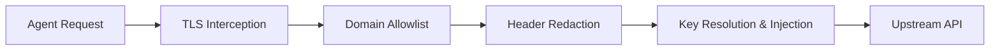

# Proxy Security Layers

The AgentSecrets local proxy is the heart of the zero-knowledge model. It sits between your AI agent and the external internet.



## Layer 1: The Domain Allowlist

The most critical defense mechanism is the strict domain allowlist.

By default, the proxy blocks **all** outbound traffic. If an agent is compromised and attempts to send data to an attacker-controlled server, the proxy will reject it with a `403 Forbidden`.

You must explicitly allowlist domains:
```bash
agentsecrets workspace allowlist add api.openai.com
```

## Layer 2: Transport Layer (TLS) Injection

The proxy operates at the transport layer, acting as a Man-in-the-Middle (MITM) for your own requests. 

When your agent makes an HTTPS request to `https://api.openai.com`, the proxy intercepts it, decrypts the local TLS traffic, injects the real API key into the `Authorization` header, and establishes a new, secure TLS 1.3 connection to OpenAI. 

The injected credential is encrypted in transit between the proxy and the upstream API.

## Layer 3: Response Redaction

Some poorly designed APIs reflect the authorization token back in the response body or headers. If the proxy detects the credential value in the upstream response, it automatically redacts it before returning the response to the AI agent.

> [NOTE]
> Response redaction relies on exact string matching. If the upstream API transforms or encodes the credential, the proxy may not detect it.

## Layer 4: SSRF Protection

To prevent Server-Side Request Forgery (SSRF), the proxy refuses to resolve loopback addresses (like `127.0.0.1` or `localhost`), internal network CIDRs (`10.0.0.0/8`, `192.168.0.0/16`), or AWS Instance Metadata endpoints (`169.254.169.254`). 

An agent cannot use the proxy to attack your internal network.

## Layer 5: Environment Output Masking (Child Process Redaction)

For integrations that require secrets to be injected directly as environment variables (via `agentsecrets env`), the parent process intercepts the child's standard output (`stdout`) and standard error (`stderr`) streams. 

If the child process attempts to print a secret or its encoding variations (Base64, Hex, URL-encoded, Case variants) to the console, the parent process sanitizes the string and replaces it with `[REDACTED]`. 

To prevent AI agents from circumventing this protection, there is no bypass configuration or command flag.

