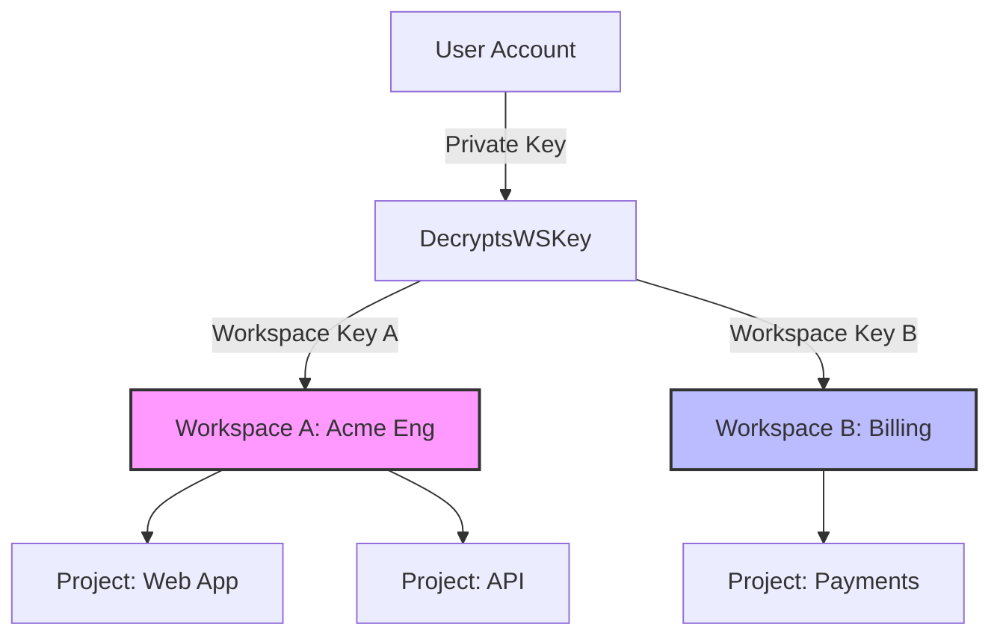

# Managing Multiple Workspaces

AgentSecrets allows you to belong to and manage multiple workspaces. You can switch contexts seamlessly from your terminal, ensuring you can transition between personal projects, company-wide engineering, and client-specific secrets in seconds.

---

## Switching between workspaces

All CLI commands run within the context of the active workspace. You can view, switch, and inspect your active workspace using simple CLI operations.

:::step
1. **List all workspaces:**
   List all workspaces your account has access to. The active workspace is marked with an asterisk (`*`):
   ```bash
   agentsecrets workspace list
   ```
   Output:
   ```
   * personal          (your-username)   ← active
     Acme Engineering  (shared)          5 members
     Billing Service   (shared)          2 members
   ```

2. **Switch the active workspace:**
   Switch your context to another workspace using its name:
   ```bash
   agentsecrets workspace switch "Acme Engineering"
   ```
   Output:
   ```
   ✓ Switched active workspace to "Acme Engineering".
   ```

3. **Verify the change:**
   Run `status` to confirm your active workspace context:
   ```bash
   agentsecrets status
   ```
:::

> [NOTE]
> To switch back to your personal workspace at any time, run:
> ```bash
> agentsecrets workspace switch personal
> ```

---

## Use cases for multiple workspaces

Maintaining multiple workspaces helps you isolate secrets across different boundaries:

- **Personal vs. Corporate Work**: Keep your personal scripts, hobby projects, and API keys inside your default `personal` workspace. Use shared corporate workspaces for team projects.
- **Client & Agency Work**: If you are a contractor or agency, create a separate workspace for each client. This guarantees that Client A's developers and agents can never access Client B's secrets, even accidentally.
- **Departmental Isolation**: Large organizations often divide workspaces by department (e.g., `Acme Engineering`, `Acme Finance`, `Acme Marketing`). This enforces the principle of least privilege, preventing non-technical teams from accessing production databases or deployment keys.

---

## Workspace isolation model

The security boundary of a workspace is enforced cryptographically and logically:



- **Cryptographic Separation**: Each workspace has its own unique, independent Workspace Key. Decrypting secrets in Workspace A is cryptographically impossible using the key from Workspace B.
- **No Cross-Pollination**: Switching workspaces changes your local CLI context completely. Commands like `secrets list`, `secrets pull`, and `secrets set` only interact with the selected workspace's database and key ring.
- **Environment Scoping**: Environments (such as `development`, `staging`, and `production`) exist within the context of a workspace. Switching workspaces automatically switches you to the default environment of that workspace's active project.
